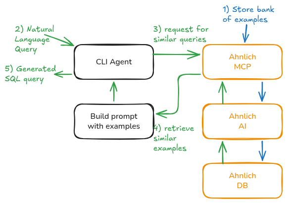

# Ahnlich MCP Few-Shot Text-to-SQL

This project shows how Ahnlich MCP can be used to give an agent access to semantically relevant demonstrations for in-context learning. The task is to convert a natural language query into an SQL. The project uses Spider 1.0 training questions as an example bank. Ahnlich embeds each natural-language question; its SQL and database ID are stored as metadata. Spider development questions are used for evaluation.

There are two parts:

- a controlled experiment comparing zero-shot, random 5-shot, and Ahnlich semantic 5-shot prompting;
- an interactive CLI agent that retrieves demonstrations through Ahnlich MCP, generates SQL, and runs it against a Spider SQLite database.

## How it works



## Setup

Requirements:

- Python 3.11–3.13
- [uv](https://docs.astral.sh/uv/)
- Docker with Docker Compose
- [Spider 1.0](https://yale-lily.github.io/spider)
- a Groq API key, or another OpenAI-compatible LLM endpoint

Install the project:

```bash
git clone https://github.com/osobotu/ahnlich-icl.git
cd ahnlich-icl
uv sync --prerelease=allow
cp .env.example .env
```

For the model used in the pilot, put this in `.env`:

```dotenv
SPIDER_DIR=data/spider
AHNLICH_STORE_NAME=spider_examples

GROQ_API_KEY=replace-me
LLM_BASE_URL=https://api.groq.com/openai/v1
LLM_MODEL=openai/gpt-oss-20b
LLM_REASONING_EFFORT=low
```

Extract Spider so these files exist:

```text
data/spider/train_spider.json
data/spider/dev.json
data/spider/dev_gold.sql
data/spider/tables.json
data/spider/database/<db_id>/<db_id>.sqlite
```

## Start Ahnlich and index the examples

```bash
docker compose up -d --wait

uv run --env-file .env python scripts/index_examples.py
```

Indexing sends all 7,000 Spider training questions through Ahnlich MCP. The Docker services use persistent named volumes, so stopping or recreating the containers preserves the store. `docker compose down -v` deletes it.

Inspect retrieval without calling the LLM:

```bash
uv run --env-file .env python scripts/inspect_retrieval.py \
  "Which employees earn more than their department average?"
```

## Run the CLI agent

Choose a Spider database and start the interactive CLI:

```bash
uv run --env-file .env python -m ahnlich_icl.agent_cli world_1
```

Then ask a question:

```text
Question> Which city has the largest population?
```

For every question, the agent:

1. searches the `spider_examples` store through Ahnlich MCP;
2. keeps matches with similarity `>= 0.5`;
3. falls back to zero-shot generation if none meet the threshold;
4. builds a prompt from the target schema and retained examples;
5. generates SQL with the configured model;
6. executes the SQL against SQLite in read-only mode; and
7. prints the retrieved examples, SQL, and result rows.

The CLI keeps the chosen database and schema loaded for repeated questions, but each question is independent. Previous questions are not added to later prompts.

The Python CLI launches the local `ahnlich-mcp --profile ai` process itself. Registering Ahnlich separately with Codex or another MCP host is not required for this command.

## Reproduce the experiment

The experiment expects the official [Spider test-suite evaluator](https://github.com/taoyds/test-suite-sql-eval) at:

```text
tools/test-suite-sql-eval/
```

and its augmented databases at:

```text
data/test-suite/database/
```

Run the stratified pilot:

```bash
uv run --env-file .env python scripts/run_experiment.py \
  --per-difficulty 30 \
  --delay-seconds 15 \
  --output results/pilot.jsonl
```

The runner writes each result immediately. If the provider rate-limits a run, continue it with `--resume`.

Generate the summary visualization:

```bash
uv run python scripts/visualize_results.py results/pilot.jsonl
```

The experiment deliberately does not use the CLI's `0.5` threshold. Its semantic condition always uses Ahnlich's top five results so the benchmark remains the originally measured baseline.

## Tests

```bash
uv run pytest
```
